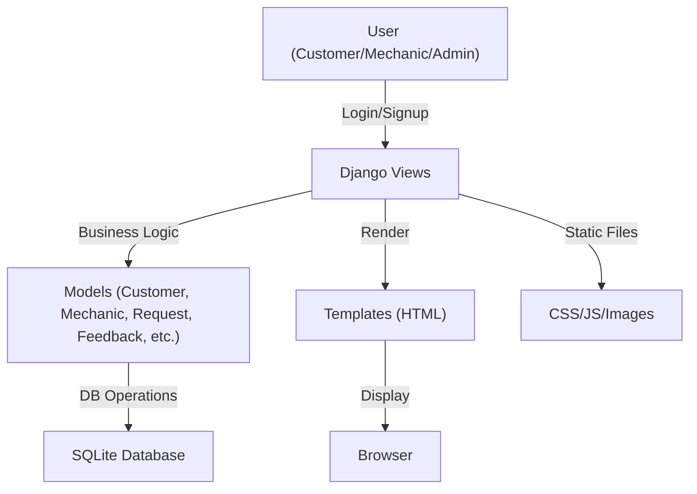
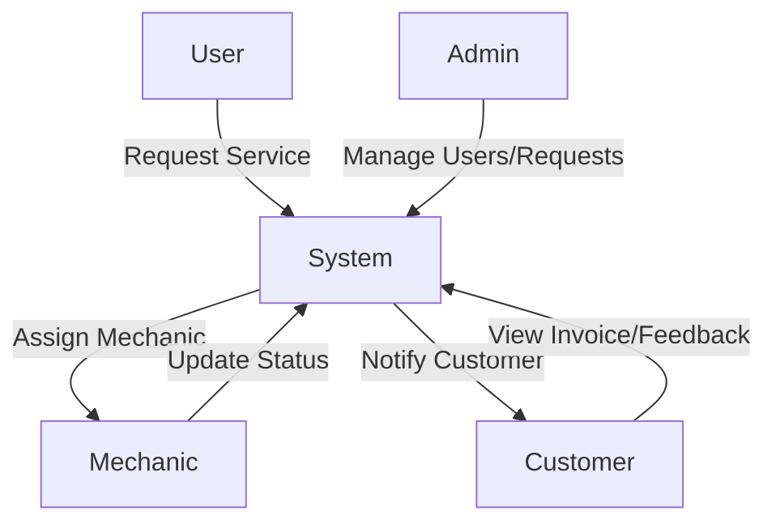
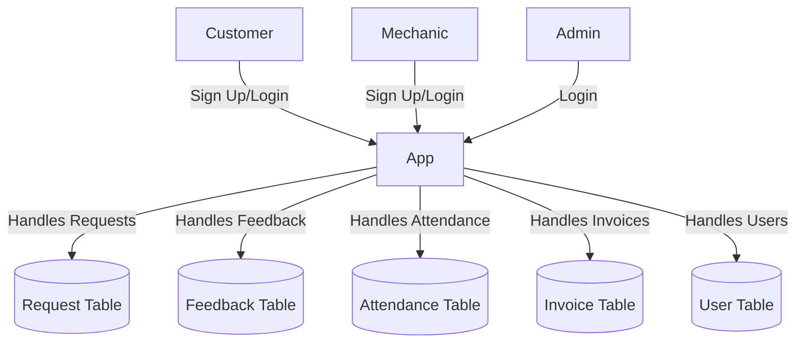
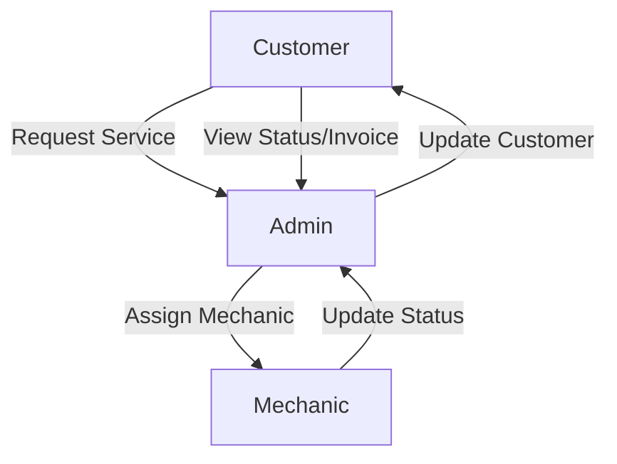
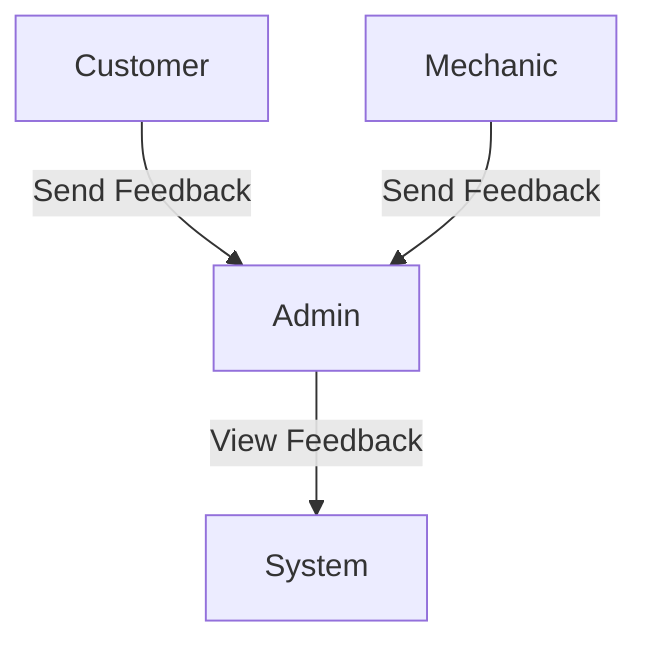
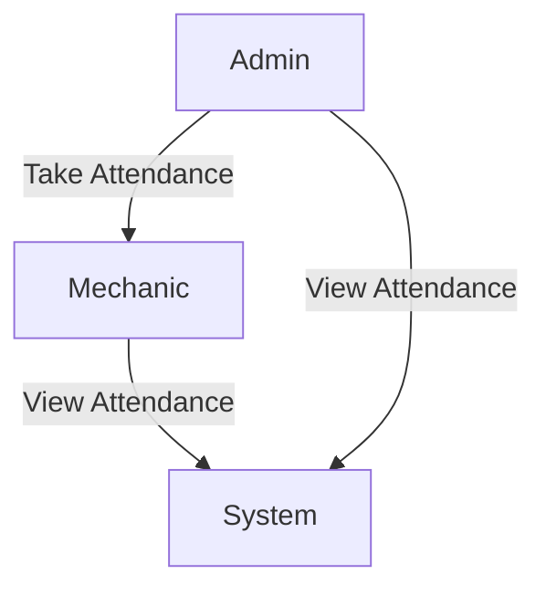

# Vehicle Service Management - Project Documentation

## Table of Contents
1. [Project Overview](#project-overview)
2. [Technologies Used](#technologies-used)
3. [System Architecture & Flow](#system-architecture--flow)
4. [Data Flow Diagrams (DFD)](#data-flow-diagrams-dfd)
5. [Entity Relationship (ER) Diagram](#entity-relationship-er-diagram)
6. [Module Descriptions](#module-descriptions)
7. [How to Run](#how-to-run)
8. [Screenshots](#screenshots)

---

## Project Overview
Vehicle Service Management is a web-based platform designed to streamline the process of vehicle servicing for customers, mechanics, and administrators. The system allows customers to request services, mechanics to manage assigned jobs, and admins to oversee all operations, ensuring transparency and efficiency.

---

## Technologies Used
- **Backend:** Django 3.0.5 (Python Web Framework)
- **Frontend:** HTML5, CSS3 (custom, offline, no Bootstrap), JavaScript (minimal)
- **Database:** SQLite3 (default Django DB)
- **Other:** Django Widget Tweaks (for form rendering), FontAwesome (local)

---

## System Architecture & Flow
The system follows a classic MVC (Model-View-Controller) pattern as implemented by Django:
- **Models:** Define the data structure (Customer, Mechanic, Request, Feedback, etc.)
- **Views:** Handle business logic and user requests
- **Templates:** Render HTML pages for the browser
- **Static Files:** CSS, JS, and images for UI/UX

### High-Level Flowchart


---

## Data Flow Diagrams (DFD)
### User Request and Assignment Flow


### Database Interaction Flow


### Admin-Mechanic-Customer Service Flow


### Feedback Flow


### Attendance Flow


---

## Entity Relationship (ER) Diagram
*Note: The following is a conceptual ER diagram. See `vehicle/models.py` for actual model fields.*

```mermaid
erDiagram
  CUSTOMER ||--o{ REQUEST : makes
  MECHANIC ||--o{ REQUEST : assigned_to
  CUSTOMER ||--o{ FEEDBACK : sends
  MECHANIC ||--o{ FEEDBACK : sends
  ADMIN ||--o{ REQUEST : manages
  REQUEST }o--|| INVOICE : generates
  MECHANIC ||--o{ ATTENDANCE : has
  CUSTOMER {
    int id
    string name
    string email
    ...
  }
  MECHANIC {
    int id
    string name
    string skill
    ...
  }
  REQUEST {
    int id
    string vehicle_no
    string status
    ...
  }
  FEEDBACK {
    int id
    string message
    ...
  }
  INVOICE {
    int id
    float amount
    ...
  }
  ATTENDANCE {
    int id
    date date
    ...
  }
```

---

## Module Descriptions
### 1. Customer Module
- **Signup/Login:** Customers register and log in to the system.
- **Request Service:** Submit vehicle service requests with details (vehicle no, model, problem, etc.).
- **View Status:** Track request status (Pending, Approved, Repairing, Done, Released).
- **Invoice:** View and download invoices for completed services.
- **Feedback:** Send feedback to admin.
- **Profile:** View and edit personal details.

### 2. Mechanic Module
- **Signup/Login:** Mechanics apply for jobs and log in after admin approval.
- **Work Assignment:** View assigned service requests.
- **Update Status:** Change status as work progresses.
- **Salary:** View salary and work history.
- **Attendance:** Mark and view attendance.
- **Feedback:** Send feedback to admin.
- **Profile:** View and edit personal details.

### 3. Admin Module
- **Login:** Secure admin login.
- **Dashboard:** Overview of all users, requests, and system status.
- **Customer Management:** Add, update, delete, and view customers.
- **Mechanic Management:** Approve, add, update, delete, and view mechanics.
- **Request Management:** Approve, assign, update, and delete service requests.
- **Invoice Management:** View and manage invoices.
- **Feedback Management:** View feedback from customers and mechanics.
- **Attendance Management:** Take and view mechanic attendance.

---

## How to Run
1. **Install Python 3.7.6** (ensure it's in your PATH)
2. **Install dependencies:**
   ```bash
   pip install -r requirements.txt
   ```
3. **Run migrations:**
   ```bash
   py manage.py makemigrations
   py manage.py migrate
   ```
4. **Start the server:**
   ```bash
   py manage.py runserver
   ```
5. **Access the app:**
   Open [http://127.0.0.1:8000/](http://127.0.0.1:8000/) in your browser.

---

## Screenshots
See the `static/screenshots/` directory for UI screenshots of the home page, dashboards, and more.

---

## Notes
- All CSS and assets are local for offline use.
- For email features (Contact Us), configure your email in `settings.py`.
- For more details, see the code and templates in the respective directories. 